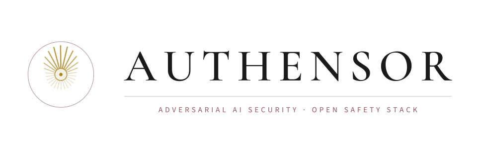
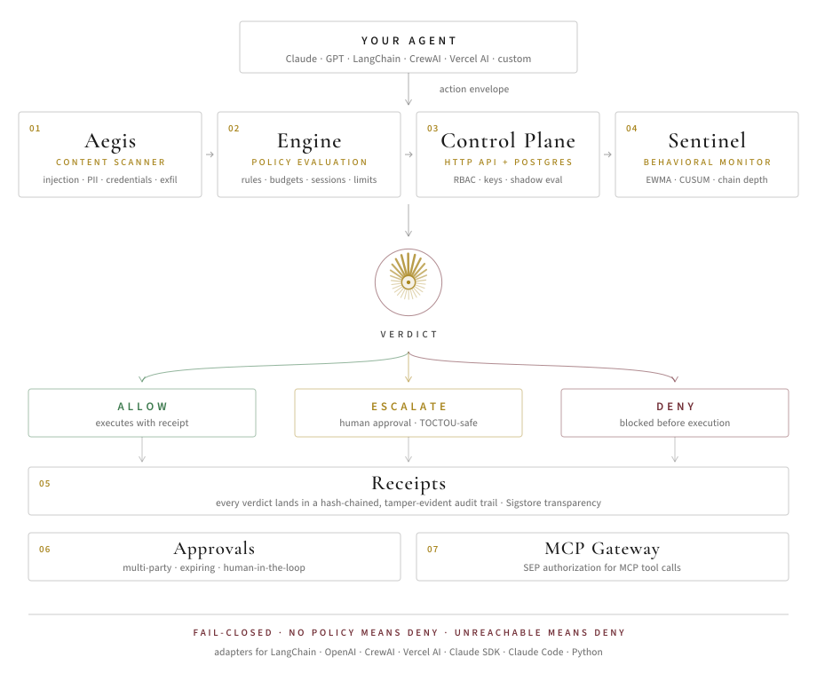

<p align="center">
  <picture>
    <source media="(prefers-color-scheme: dark)" srcset=".github/assets/banner-dark.svg">
    
  </picture>
</p>

<p align="center">
  <strong>Open-source safety stack for AI agents.</strong><br>
  <em>Gate every tool call. Scan every input. Monitor every session. Audit everything.</em>
</p>

<p align="center">
  <a href="LICENSE"></a>
  <a href="https://github.com/authensor/authensor/actions"></a>
  <a href="https://www.npmjs.com/org/authensor"></a>
  <a href="docs/owasp-agentic-alignment.md"></a>
  <a href="docs/eu-ai-act-compliance.md"></a>
  
</p>

<br>

```bash
npx @authensor/create-authensor my-agent
cd my-agent && npm install && npm run demo
```

<p align="center">
  <a href="#architecture">Architecture</a> &middot;
  <a href="#packages">Packages</a> &middot;
  <a href="docs/quickstart.md">Quickstart</a> &middot;
  <a href="docs/why.md">Why Authensor</a> &middot;
  <a href="docs/red-teaming.md">Red Teaming</a> &middot;
  <a href="#research">Research</a> &middot;
  <a href="#work-with-us">Work With Us</a>
</p>

---

## Research

Authensor audits the infrastructure the AI safety field uses to measure itself, and files every finding upstream in public.

- **99 defect reports** across **46 organizations** in evaluation, guardrail, and training infrastructure
- **16 landed fixes**, including **7 in UK AI Security Institute repos** (`inspect_ai`, `inspect_evals`, `inspect_cyber`, `control-arena`), plus Meridian Labs, Databricks, NVIDIA and Presidio
- **76 of those defects are a single class**: the evaluator trusts an artifact the evaluated system controls

The stack below is hardened against what that audit found.

## Work With Us

Red-team engagements, evaluator and scorer audits, and adversarial testing for teams shipping AI agents.

[authensor.com](https://www.authensor.com) &middot; john@authensor.com

---

## Architecture

<p align="center">
  <picture>
    <source media="(prefers-color-scheme: dark)" srcset=".github/assets/architecture-dark.svg">
    
  </picture>
</p>

Every agent action (tool call, API request, file write, message send) is wrapped in an **action envelope** and evaluated through five layers before execution. No policy loaded? Denied. Control plane unreachable? Denied. Unknown action type? Denied. Fail-closed by default.

---

## Try It in 30 Seconds

The demo runs an agent that attempts destructive file operations, unauthorized API calls, and data exfiltration. Authensor catches each one through policy enforcement, content scanning, and approval workflows.

### One-Click Deploy

[](https://railway.com/template/authensor)
[](https://render.com/deploy)

---

## Packages

### Core

| Package | Description | Deps |
|---------|-------------|------|
| `@authensor/schemas` | JSON Schema definitions, the single source of truth | 0 |
| `@authensor/engine` | Pure policy evaluation (conditions, sessions, budgets, constraints) | 0 |
| `@authensor/aegis` | Content safety scanner (injection, jailbreak, PII, memory poisoning, multimodal) | 0 |
| `@authensor/sentinel` | Real-time monitoring (EWMA/CUSUM anomaly detection, chain tracking, alerts) | 0 |
| `@authensor/control-plane` | HTTP API: evaluate, receipts, approvals, policies, budgets, shadow eval | Hono, pg |
| `@authensor/mcp-server` | MCP tools with policy enforcement (Stripe, GitHub, HTTP) | -- |
| `@authensor/sdk` | TypeScript SDK for agent builders | -- |
| `@authensor/cli` | CLI: `authensor policy lint`, `authensor policy test`, `authensor policy diff` | -- |
| `authensor` (Python) | Python SDK | -- |
| `@authensor/create-authensor` | Project scaffolder: `npx @authensor/create-authensor` | -- |
| `@authensor/redteam` | Adversarial red-team test seeds (15 attack patterns, 5 categories, MITRE ATLAS mapped) | 0 |

### Framework Adapters

| Package | Framework | Description |
|---------|-----------|-------------|
| `@authensor/langchain` | LangChain / LangGraph | Guardrail + interrupt integration |
| `@authensor/openai` | OpenAI Agents SDK | Pre-execution guardrail |
| `@authensor/vercel-ai-sdk` | Vercel AI SDK | Middleware integration |
| `@authensor/claude-agent-sdk` | Claude Agent SDK | Tool-use guardrail |
| `authensor-crewai` (Python) | CrewAI | Task guardrail |
| -- | Claude Code | Hooks-based PreToolUse / PostToolUse integration |
| `@authensor/sdk` | TypeScript SDK | Direct integration for any TS agent |
| `authensor` (Python) | Python SDK | Direct integration for any Python agent |

### Companion Tools

| Tool | Description |
|------|-------------|
| [SafeClaw](https://github.com/authensor/safeclaw) | Local agent gating with PreToolUse hooks, mobile PWA dashboard, swipe-to-approve |
| [ai-seclists](https://github.com/authensor/ai-seclists) | AI security payloads and wordlists: prompt injection, jailbreaks, model exploitation. The SecLists of AI |
| [prompt-injection-benchmark](https://github.com/authensor/prompt-injection-benchmark) | Standardized benchmark for AI safety scanners: run your scanner, get a score |
| [Chainbreaker](https://github.com/chainbreaker-ai/chainbreaker) | Adversarial red-teaming for AI agents: multi-step attack chains, MITRE ATLAS mapped, 15-dimension CBS scoring |

## Documentation

| | |
|---|---|
| [Quickstart](docs/quickstart.md) | Self-hosted setup, TypeScript and Python integration, framework adapters, CLI |
| [Why Authensor](docs/why.md) | The problem, the five layers, why the stack is free |
| [Features](docs/features.md) | Aegis content safety, session rules, budgets, Sentinel monitoring, shadow policies |
| [Red teaming](docs/red-teaming.md) | The adversarial harness, what gets tested, how it runs |
| [API reference](docs/api.md) | Control-plane endpoints |
| [Deployment](docs/deployment.md) | Self-hosted vs hosted, production deployment |
| [Development](docs/development.md) | Building and testing the monorepo |
| [OWASP Agentic Top 10](docs/owasp-agentic-alignment.md) | Coverage mapping, 10/10 |
| [EU AI Act](docs/eu-ai-act-compliance.md) | Article-by-article alignment |


## Contributing

We welcome contributions! See [CONTRIBUTING.md](CONTRIBUTING.md) for guidelines.

Authensor is built on the belief that **safety tooling should not have a paywall**. We open-source every line of safety code because the more people who use these tools, the safer agents get for everyone.

## License

MIT. Use it however you want.
